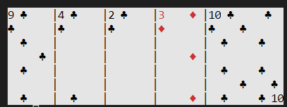
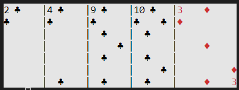
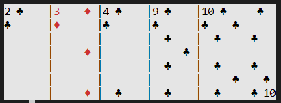
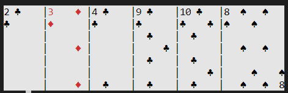
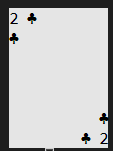
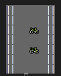
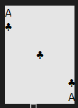
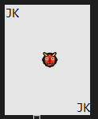
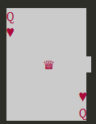
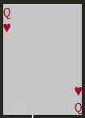

# terminal_playing_cards

[](https://circleci.com/gh/pwildenhain/terminal_playing_cards)
[](https://codecov.io/gh/pwildenhain/terminal_playing_cards)

Python 📦 for building playing card games in the terminal.

Checkout how pretty these cards look in a terminal window!


Checkout this [blackjack](https://github.com/pwildenhain/blackjack) repo for an example of how to use `terminal_playing_cards` to create python card games that run in a terminal window.

1. [Getting started](#getting-started)
2. [Customize a View](#customize-a-view)
    * [Negative spacing](#negative-spacing)
    * [Sorting](#sorting)
    * [Adding cards](#adding-cards)
    * [Removing cards](#removing-cards)
3. [Customize a Deck](#customize-a-deck)
    * [Customize card values](#customize-card-values)
    * [Hidden cards](#hidden-cards)
    * [Add Joker cards](#add-joker-cards)
    * [Remove face card emojis](#remove-face-card-emojis)
4. [Built-in methods](#built-in-methods)
    * [Math with Cards](#math-with-cards)
    * [Iterate through a Deck/View](#iterate-through-a-deck/view)
    * [Check the length of a Deck/View](#check-the-length-of-a-deck/view)

## Getting started

:arrow_down: Install the package from PyPI.

```
pip install terminal_playing_cards
```

:hammer: Build a standard 52 playing card deck.

```python
from terminal_playing_cards import Deck

deck = Deck()
```

:arrows_counterclockwise: Shuffle the deck, deal out some cards, and convert the list of cards into a `View` that can be printed to the terminal.

```python
>>> from terminal_playing_cards import View

>>> deck.shuffle()
# Deal 5 cards
>>> player_1_hand = View([deck.pop() for _ in range(5)])
>>> print(player_1_hand)
```


## Customize a View

### Negative spacing

If you anticipate having a lot of cards in a single `View`, specify a negative value for the `View.spacing` attribute.

```python
>>> player_1_hand = View(
...     cards=[deck.pop() for _ in range(5)],
...     spacing=-5
... )
>>> print(player_1_hand)
```



### Sorting

Whenever I play card games, I have a particular way I like to sort my hand. Use the `View.sort()` method to sort a `View` by value, suit, or both!

```python
>>> player_1_hand.sort()
>>> print(player_1_hand)
```



If you prefer to sort purely by value, specify that in `sort_order`.

```python
>>> player_1_hand.sort(sort_order=["value"])
>>> print(player_1_hand)
```



See `help(View.sort)` for further details.

### Adding cards

Adding cards to a `View` is easy! Just deal another card from the deck, and add it to the existing view.

```python
>>> next_card = deck.pop()
>>> player_1_hand += [next_card]
>>> print(player_1_hand)
```



Notice that this was done with a `list` of `Card` objects. This allows multiple cards to be added into a `View` at one time, and also allows two `View` objects to be added together.

### Removing cards

Since `View` inherits many of it's methods from `Deck`, use the `View.pop()` to kick cards out of a `View`

```python
>>> played_card = player_1_hand.pop()
>>> print(played_card)
```


And now our hand doesn't have that card in it anymore.

```python
>>> print(player_1_hand)
```


## Customize a Deck

### Customize card values

In a game like [Blackjack](https://en.wikipedia.org/wiki/Blackjack), face cards are all valued at ten. But the default deck specifications assign a jack a value of eleven. Set the `specifications` parameter to customize options like card values.

```python
>>> blackjack_deck = Deck(specifications=["face_cards_are_ten"])
```

See `help(Deck)` for more details on how to customize `Deck` build specifications.

### Hidden cards

If you were going to build a game like [Texas hold'em](https://en.wikipedia.org/wiki/Texas_hold_%27em) then you would want to hide the turn and the river cards by default.

When building the `Deck`, set the `hidden` parameter to hide all cards  when printed to the terminal by default.

```python
>>> hidden_deck = Deck(hidden=True)
>>> top_card = hidden_deck.pop()
>>> print(top_card)
```



This ensures that that "back" of a card is printed to the terminal, rather than the regular face. In order to reveal this card, set the `Card.hidden` attribute to `False`.

```python
>>> top_card.hidden = False
>>> print(top_card)
```


### Add Joker cards

[Jokers](https://en.wikipedia.org/wiki/Joker_(playing_card)) aren't included in a `Deck` by default. Add them in after the fact if you need them for your game.

```python
>>> from terminal_playing_cards import Card

>>> deck = Deck()
>>> jokers = [Card("JK", suit="none") for _ in range(2)]
>>> deck += jokers
>>> print(deck[53])
```



### Remove face card emojis

On some terminal windows, emoji's don't print out as expected. Check out how the queen of hearts prints out in the [cmder](https://cmder.net/) console emulator.



:rage: Why is it messed up??? :rage:

Never fear! If this happens on your terminal, make sure to set `picture` parameter to False when building the `Deck`.

```python
>>> no_pic_deck = Deck(picture=False)
# Default position of queen of hearts in a sorted Deck
>>> queen_hearts = no_pic_deck[47]
>>> print(queen_hearts)
```



:+1: That's more like it!

## Built-in methods

### Math with Cards

All cards have a `Card.value` attribute that is used for logical comparisions and simple arithmetic with numbers and other `Card` objects.

```python
>>> from terminal_playing_cards import Card

>>> ace_spades = Card("A", "spades", value=1)
>>> ace_hearts = Card("A", "hearts", value=1)
>>> two_hearts = Card("2", "hearts", value=2)
>>> ace_spades < two_hearts
True
>>> ace_spades == ace_hearts
True
>>> two_hearts - 1
1
>>> sum([ace_spades, ace_hearts, two_hearts])
4
```

Note: Equality is based on **value alone**. This is why the `ace_spades` is equal to the `ace_hearts` even though they have different suits.

### Iterate through a Deck/View

Iteration is simple, treat a `Deck`/`View` as a list of `Card` objects.

```python
>>> deck = Deck()
>>> hand = View([deck.pop() for _ in range(3)])
>>> for card in hand:
...     print(repr(card))
Card('A', 'clubs', value=1, hidden=False, picture=True)
Card('A', 'diamonds', value=1, hidden=False, picture=True)
Card('A', 'spades', value=1, hidden=False, picture=True)
>>> for card in deck[:3]:
...     print(repr(card))
Card('A', 'hearts', value=1, hidden=False, picture=True)
Card('2', 'clubs', value=2, hidden=False, picture=True)
Card('2', 'diamonds', value=2, hidden=False, picture=True)
```

### Check the length of a Deck/View

Easy-peasy.

```python
>>> deck = Deck()
>>> len(deck)
52
>>> hand = View([deck.pop() for _ in range(3)])
>>> len(hand)
3
```
