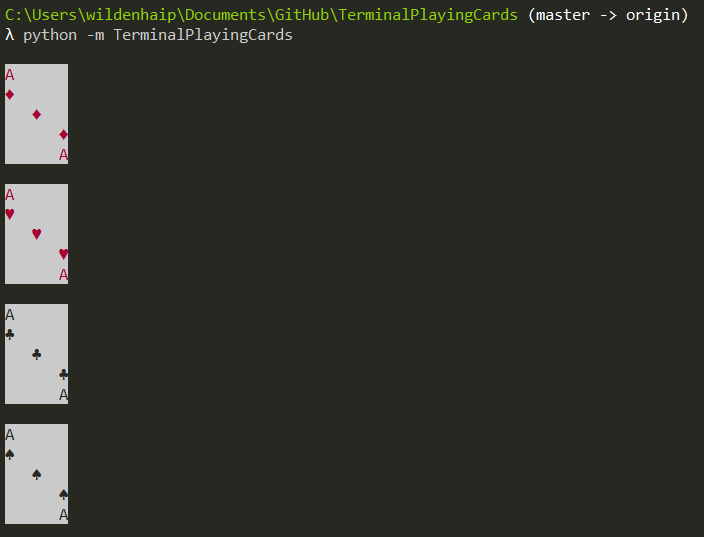

.. TerminalPlayingCards documentation master file, created by
   sphinx-quickstart on Mon May 20 21:09:01 2019.
   You can adapt this file completely to your liking, but it should at least
   contain the root `toctree` directive.

Playing cards for the terminal
==============================

Quickstart
^^^^^^^^^^

Checkout how the cards look in the terminal::

    $ python -m TerminalPlayingCards

|screenshot|

.. toctree::
   :maxdepth: 2

Indices and tables
==================

* :ref:`genindex`
* :ref:`modindex`
* :ref:`search`
